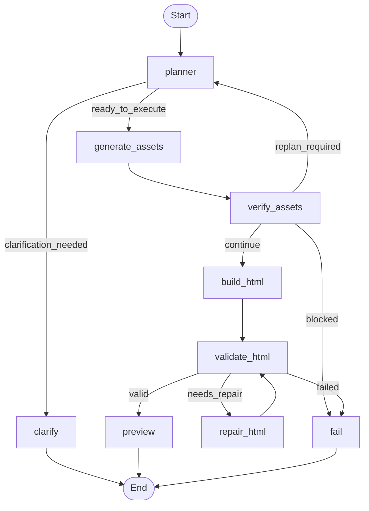

# LangGraph Media Agent

Web UI agent for prompt-to-video production on top of HyperFrames.

## Why This Approach

This project is intentionally not a "generate one long video clip and hope for the best" workflow. It combines short generated media with HTML-based composition, which gives it three practical advantages:

1. **Better transitions with HTML**
   - Scene-to-scene transitions are built in HTML/CSS/GSAP instead of relying only on raw video generation.
   - That makes transitions more stable, smoother, and far more controllable.
   - It also gives access to a richer visual vocabulary: wipes, layered reveals, masked motion, typography-led transitions, and other deterministic effects that are difficult to get consistently from a single generated video.

2. **Better text and typography**
   - Text rendering inside generated video clips is often unreliable: wrong layout, weak hierarchy, poor readability, or awkward motion.
   - HTML composition fixes that gap by handling titles, price cards, product callouts, subtitles, captions, and text animation in a deterministic layer.
   - This is especially useful for ads, e-commerce creatives, and information-dense short videos where text quality directly affects performance.

3. **Much better cost efficiency**
   - A full 30-second video generated entirely with a model such as Seedance 2.0 may cost around `30 RMB`.
   - In this project, the same style of output can often be built from:
     - one 5-second generated video clip, around `5 RMB`
     - around six generated images, around `1 RMB`
     - LLM / planning / HTML authoring token usage at roughly million-token scale, around `1 RMB`
   - That means many ad and commerce scenarios can land closer to `7 RMB` instead of `30 RMB`, while still gaining better text control and more polished transitions.

In practice, this architecture is particularly attractive for performance ads, product promos, e-commerce materials, and other asset-driven short-form content where quality-per-cost matters.

## What It Does

- Accepts user text input and optional reference images
- Uses a LangGraph planner / executor / verifier loop
- Asks clarification questions when the request is underspecified
- Generates local image/video assets via the existing media pipeline scripts
- Generates per-scene TTS narration audio for scenes that need voiceover
- Loads skill context dynamically from:
  - `skills/`
  - `.trae/skills/`
- Combines resolved local asset metadata with HyperFrames skill guidance to author final `index.html`
- Starts a HyperFrames preview server and returns a preview URL
- Accepts user feedback and reruns the graph for another draft
- Renders final MP4 after the user confirms

## Architecture

The loop is:

1. `planner`
   - Reads user request, optional uploaded images, previous feedback, and available skills
   - Outputs a structured production plan
2. `executor`
   - Writes `pipeline.json`
   - Runs `demo-minimal/build_media_pipeline.py`
   - Generates `pipeline.resolved.json` and `creative-brief.md`
3. `verifier`
   - Checks whether the asset stage is sufficient for HTML authoring
4. `html author`
   - Uses selected skill content plus resolved metadata to write HyperFrames HTML
5. `validate`
   - Runs `hyperframes lint` and `hyperframes validate`
   - If validation fails, attempts one repair pass
6. `preview`
   - Starts `hyperframes preview`
   - Returns a preview URL

## Graph Visualization



Node summary:

- `planner`
  - Reads the user request, uploaded images, feedback history, and dynamic skill list
  - Uses prompt-driven JSON output and local validation into `PlanResult`
- `clarify`
  - Stops the run early when the request is underspecified and returns clarification questions
- `generate_assets`
  - Writes `pipeline.json` and runs the media pipeline script to create local assets and resolved metadata
- `verify_assets`
  - Validates whether the asset stage is sufficient for final HyperFrames authoring
- `build_html`
  - Uses skill-guided file tools to write the final HyperFrames `index.html`
- `validate_html`
  - Runs `hyperframes lint` and `hyperframes validate`
- `repair_html`
  - Performs one repair pass when validation fails
- `preview`
  - Starts a local preview server and stores the preview URL in session state
- `fail`
  - Marks the run as failed

## Project Layout

```text
langgraph-media-agent/
  app.py
  requirements.txt
  .env.example
  app/
    config.py
    graph.py
    hyperframes_runner.py
    llm.py
    models.py
    pipeline_tools.py
    server.py
    skill_registry.py
    storage.py
    templates/
      index.html
  runs/
```

## Requirements

- Python 3.10+
- Node.js 22+
- HyperFrames CLI available (`hyperframes`)
- `ARK_API_KEY` or another OpenAI-compatible key configured

Install HyperFrames CLI:

```bash
npm i -g hyperframes
```

(Optional, recommended for CI / reproducible setups) Install locally in this repo instead of global:

```bash
npm i -D hyperframes
```

Install Python deps:

```bash
cd langgraph-media-agent
pip install -r requirements.txt
```

## Environment

Copy `.env.example` and export the real values in your shell:

```bash
MODEL_API_BASE=https://ark.cn-beijing.volces.com/api/v3
MODEL_API_KEY_ENV=ARK_API_KEY
MODEL_NAME=ep-your-chat-model
TTS_PROVIDER_ENDPOINT=https://openspeech.bytedance.com/api/v3/tts/unidirectional
TTS_PROVIDER_APP_ID=your_app_id
TTS_PROVIDER_ACCESS_KEY=your_access_key
TTS_PROVIDER_RESOURCE_ID=your_resource_id
TTS_PROVIDER_VOICE=zh_female_cancan_mars_bigtts
APP_HOST=127.0.0.1
APP_PORT=8010
HYPERFRAMES_BIN=
HYPERFRAMES_COMMAND_TIMEOUT_SECONDS=180
HYPERFRAMES_RENDER_TIMEOUT_SECONDS=1800
```

Also export your real key:

```bash
set ARK_API_KEY=your_real_key
```

## Run

```bash
cd langgraph-media-agent
python app.py
```

Open:

```text
http://127.0.0.1:8010
```

## API

### `POST /api/sessions`

Starts a new run.

Form fields:

- `request`: required text prompt
- `images`: optional uploaded files

### `POST /api/sessions/{session_id}/feedback`

Sends revision feedback and reruns the graph.

### `GET /api/sessions/{session_id}`

Reads the saved session state.

## Session Artifacts

Each run writes to:

```text
langgraph-media-agent/runs/<session_id>/
  uploads/
  pipeline.json
  project/
    assets/
    pipeline.resolved.json
    creative-brief.md
    index.html
    meta.json
    output.mp4
```

## Dynamic Skill Calling

Skills are discovered at runtime from the repo skill directories.

The planner can select skills such as:

- `hyperframes-media-pipeline`
- `hyperframes`
- `gsap`
- `hyperframes-cli`
- `website-to-hyperframes`

The final HTML authoring step injects the selected skill content directly into the LLM prompt so the generated composition follows HyperFrames rules and local project conventions.

## File Tools For Skill-Guided Authoring

During the HTML authoring and repair stages, the model can dynamically call five internal tools:

- `list_dir`
  - Lists files and folders before the model decides what to inspect
- `read_file`
  - Reads project files, resolved pipeline metadata, creative briefs, and skill files
- `write_file`
  - Writes files inside the current run's project directory
- `patch_file`
  - Applies small targeted text replacements to existing files
- `run_script`
  - Runs a whitelisted Python script and returns stdout/stderr (no arbitrary shell)

This means the authoring step can:

- inspect available files before reading them
- inspect `pipeline.resolved.json`
- inspect `creative-brief.md`
- inspect existing `index.html`
- inspect skill support files when needed
- write `index.html`
- write helper JSON or draft files inside the project directory
- patch only the parts of `index.html` that need revision

The tools are intentionally sandboxed:

- readable roots include the current project, repo root, and skill directories
- writable roots are limited to the current project directory
- executable scripts are limited to an allowlist (the media pipeline scripts)

## Notes

- This is a Web UI, not a desktop control client
- The DesktopAgent repo is used only as architecture inspiration for:
  - planner
  - executor
  - verifier
  - loop
- Media generation and HyperFrames rendering remain separate stages for deterministic output

## Decoupling Note

This agent does not depend on `demo-minimal/`.

- Pipeline scripts live in `langgraph-media-agent/scripts/`
- `run_script` can only run whitelisted scripts (defaults to the scripts in this project)
