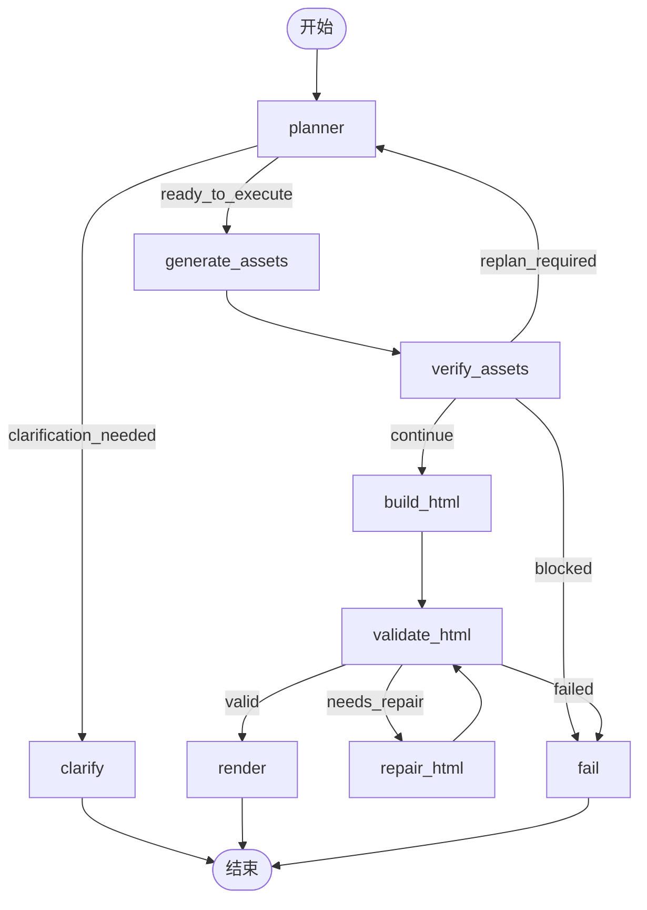

# LangGraph Media Agent

基于 HyperFrames 的文生视频 Web UI 代理。

## 方案优势

这个项目不是“直接一次性生成一个长视频片段”的思路，而是把短视频素材生成和基于 HTML 的最终合成结合起来。在广告、电商、素材投放等场景里，这种方案有三个非常实际的优势：

1. **转场更稳定、更丝滑、更丰富**
   - 分镜之间的转场特效由 HTML / CSS / GSAP 来完成，而不是完全依赖生视频模型一次性生成。
   - 这样做的好处是：效果更稳定、衔接更丝滑、可控性更强。
   - 同时还能更容易做出丰富的转场形式，比如遮罩切换、分层 reveal、文字驱动转场、局部动画过渡等，这些都比纯生视频更容易稳定复现。

2. **文字与文字动效效果更好**
   - 直接生视频时，文字往往是短板，常见问题包括排版差、层级弱、清晰度不够、动效僵硬，甚至文案内容都容易出错。
   - 用 HTML 合成可以很好弥补这个问题，把标题、价格、卖点、按钮引导、字幕、标签和各种文字动效放到一个确定性的图层里处理。
   - 这对广告素材、电商详情短视频、带强信息表达的投放内容尤其重要，因为这类内容对文字质量非常敏感。

3. **性价比更高**
   - 如果一个 30 秒视频完全依赖 Seedance 2.0 这类模型直接生成，成本可能在 `30 元` 左右。
   - 用这个项目的方案，很多情况下只需要：
     - 1 个 5 秒左右的视频素材，约 `5 元`
     - 6 张左右图片素材，约 `1 元`
     - 再加上规划、HTML 创作等百万级 token 消耗，约 `1 元`
   - 也就是说，同类型的 30 秒内容，整体成本可能在 `7 元` 左右，而不是 `30 元` 左右，同时还能获得更好的文字控制和转场表现。

因此，这套架构特别适合广告素材、电商素材、商品种草、促销短视频等“既要效果、又要成本可控”的场景。

## 项目功能

- 接收用户文本输入和可选参考图片
- 使用 LangGraph 的 `planner / executor / verifier` 流程组织生成任务
- 当用户需求不明确时自动发起澄清问题
- 通过现有媒体流水线脚本生成本地图片/视频素材
- 动态加载以下目录中的技能上下文：
  - `skills/`
  - `.trae/skills/`
- 将已解析的本地素材信息与 HyperFrames 技能规则结合，生成最终 `index.html`
- 在 `hyperframes lint` 和 `hyperframes validate` 通过后自动渲染最终 MP4
- 接收用户反馈并重新进入生成流程

## 架构概览

主流程如下：

1. `planner`
   - 读取用户请求、可选上传图片、历史反馈和可用技能
   - 输出结构化生产计划
2. `executor`
   - 写入 `pipeline.json`
   - 运行 `scripts/build_media_pipeline.py`
   - 生成 `pipeline.resolved.json` 和 `creative-brief.md`
3. `verifier`
   - 检查素材阶段是否足以进入 HTML 创作
4. `html author`
   - 使用已选技能内容和解析后的素材元数据生成 HyperFrames HTML
5. `validate`
   - 运行 `hyperframes lint` 和 `hyperframes validate`
   - 若校验失败，尝试执行一次修复
6. `render`
   - 校验通过后直接自动渲染最终 MP4

## 图流程



节点说明：

- `planner`
  - 读取用户请求、上传图片、反馈历史和动态技能列表
  - 基于提示词生成 JSON，再校验成 `PlanResult`
- `clarify`
  - 当请求信息不足时提前结束，并返回澄清问题
- `generate_assets`
  - 写入 `pipeline.json`，并运行媒体流水线脚本生成本地素材和解析后的元数据
- `verify_assets`
  - 检查素材结果是否足以进入最终 HyperFrames 创作
- `build_html`
  - 使用技能引导的文件工具写入最终 HyperFrames `index.html`
- `validate_html`
  - 运行 `hyperframes lint` 与 `hyperframes validate`
- `repair_html`
  - 当校验失败时执行一轮修复
- `render`
  - 校验通过后自动渲染最终视频，输出 `output.mp4`
- `fail`
  - 将本次运行标记为失败

## 目录结构

```text
langgraph-media-agent/
  app.py
  requirements.txt
  .env.example
  README.md
  README.zh-CN.md
  app/
    config.py
    graph.py
    hyperframes_runner.py
    llm.py
    models.py
    pipeline_tools.py
    server.py
    skill_registry.py
    storage.py
    templates/
      index.html
  runs/
  scripts/
```

## 环境要求

- Python 3.10+
- Node.js 22+
- 可用的 HyperFrames CLI（`hyperframes`）
- 已配置 `ARK_API_KEY` 或其它兼容 OpenAI 风格接口的密钥

安装 HyperFrames CLI：

```bash
npm i -g hyperframes
```

可选，推荐用于 CI 或可复现环境，在仓库内本地安装而不是全局安装：

```bash
npm i -D hyperframes
```

安装 Python 依赖：

```bash
cd langgraph-media-agent
pip install -r requirements.txt
```

## 环境变量

复制 `.env.example`，并在你的环境中填入真实值：

```bash
MODEL_API_BASE=https://ark.cn-beijing.volces.com/api/v3
MODEL_API_KEY_ENV=ARK_API_KEY
MODEL_NAME=ep-your-chat-model
APP_HOST=127.0.0.1
APP_PORT=8010
HYPERFRAMES_BIN=
HYPERFRAMES_COMMAND_TIMEOUT_SECONDS=180
HYPERFRAMES_RENDER_TIMEOUT_SECONDS=1800
```

同时导出你的真实密钥：

Windows PowerShell：

```powershell
$env:ARK_API_KEY="your_real_key"
```

macOS / Linux：

```bash
export ARK_API_KEY=your_real_key
```

## 运行方式

```bash
cd langgraph-media-agent
python app.py
```

打开：

```text
http://127.0.0.1:8010
```

## API

### `POST /api/sessions`

启动一次新的生成任务。

表单字段：

- `request`：必填，文本需求
- `images`：可选，上传的参考图片

### `POST /api/sessions/{session_id}/feedback`

提交修改意见，并基于当前会话重新运行生成流程。

### `GET /api/sessions`

读取会话列表。

### `GET /api/sessions/{session_id}`

读取单个会话的完整状态。

## 会话产物

每次运行会写入：

```text
langgraph-media-agent/runs/<session_id>/
  uploads/
  pipeline.json
  session.json
  project/
    assets/
    pipeline.resolved.json
    creative-brief.md
    index.html
    meta.json
    output.mp4
```

## 动态技能加载

技能会在运行时从仓库技能目录中发现并加载。

规划阶段可能选择的技能包括：

- `hyperframes-media-pipeline`
- `hyperframes`
- `gsap`
- `hyperframes-cli`
- `website-to-hyperframes`

在最终 HTML 创作阶段，系统会把所选技能内容直接注入 LLM 提示词，使生成的页面遵循 HyperFrames 规则和本项目约定。

当前实现还支持：

- 自动展开 `SKILL.md` 中引用的本地 markdown 文档
- 将这些引用文档一起注入技能上下文
- 在 HTML 生成与修复阶段明确要求优先遵循 skill context

## 技能驱动的文件工具

在 HTML 生成与修复阶段，模型可以动态调用 5 个内部工具：

- `list_dir`
  - 在决定读取哪些文件之前，先列出当前目录结构
- `read_file`
  - 读取项目文件、解析后的流水线元数据、创意简报和技能文件
- `write_file`
  - 在当前 run 的项目目录中写入文件
- `patch_file`
  - 对已有文件做小范围定向替换
- `run_script`
  - 运行白名单中的 Python 脚本，并返回 stdout / stderr，不允许任意 shell

这意味着 HTML 创作阶段可以：

- 检查可用文件再决定读取内容
- 检查 `pipeline.resolved.json`
- 检查 `creative-brief.md`
- 检查已有 `index.html`
- 在需要时读取 skill 支持文件
- 写入 `index.html`
- 在项目目录中写入辅助 JSON 或草稿文件
- 只修补 `index.html` 中需要改动的部分

工具的沙箱限制如下：

- 可读根目录包括当前项目、仓库根目录和技能目录
- 可写根目录仅限当前项目目录
- 可执行脚本仅限白名单（默认是当前项目内的媒体流水线脚本）

## 说明

- 这是一个 Web UI，不是桌面控制客户端
- `DesktopAgent` 仓库仅作为以下架构灵感来源：
  - planner
  - executor
  - verifier
  - loop
- 媒体生成与 HyperFrames 最终渲染仍然保持分离，以保证输出更可控、更稳定

## 解耦说明

本代理不依赖 `demo-minimal/`。

- 流水线脚本位于 `langgraph-media-agent/scripts/`
- `run_script` 只能执行白名单脚本，默认就是本项目里的脚本
